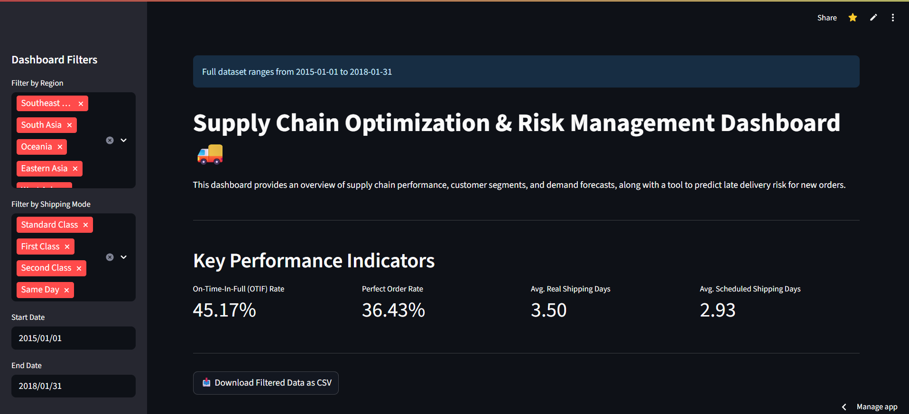
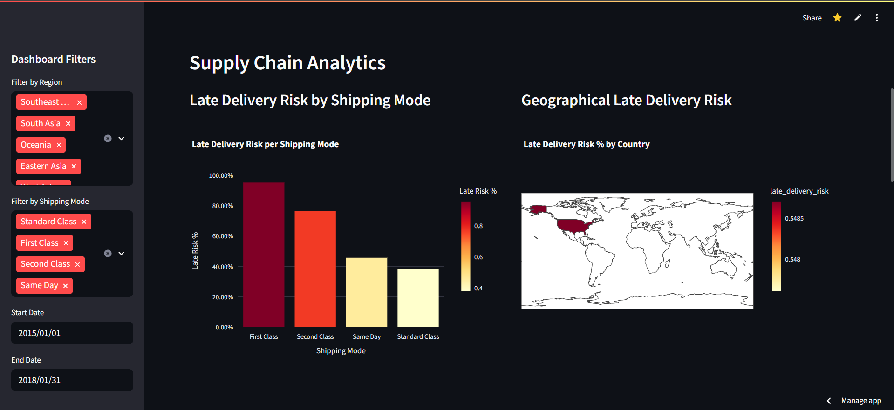
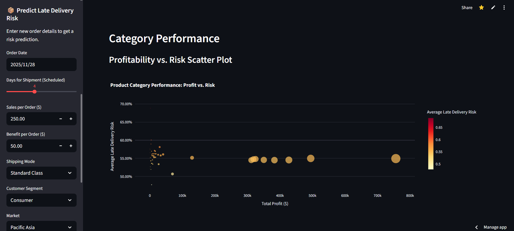

---

# 📦 Supply Chain Optimization & Risk Management Dashboard

A comprehensive **data-driven dashboard** built with **Python** and **Streamlit** to analyze supply chain performance, predict late delivery risks, and provide actionable insights for logistics management.

---

## 🚀 Live Demo  
https://supply-chain-optimization-and-risk-management.streamlit.app/

---

## ✨ Key Features

### 📊 Supply Chain KPIs

- Executive KPIs: Instant view of OTIF (On-Time-In-Full) Rate, Perfect Order Rate, and Late Delivery Risk ratio.
- Reliability Insights: Customer-wise and category-wise late delivery risk trends.

### 🔍 Interactive Data Analytics

- Dynamic Visualizations: Plotly & Streamlit-powered interactive charts (Profit vs Risk, Order Volume Trends).
- Risk Heatmaps: Region-level and market-level delivery-risk intensity mapping.
- Exploratory Segmentation (Optional): Customer clusters from K-Means shown for analysis only.

### 🤖 ML-Powered Delivery Risk Prediction

- Primary Model: XGBoost used inside a Scikit-learn pipeline for late delivery risk classification.
- Robust Processing: Creates final_data_with_segments.csv even if segmentation file is missing.
- Model Evaluation: Weighted F1, ROC-AUC, confusion matrix, precision-recall, classification report.

### 🚚 Intelligent Shipping Recommendation

- Optimal Shipping Suggestions: Chooses best shipping mode using ↓ delivery risk × ↑ profit per scheduled day.
- Profit Efficiency Metric: Uses profit_per_day_scheduled in recommendation logic.

### ⚙️ Data Operations & Usability

- Smart Filtering: Filter by market, region, shipping mode, date, weekday/weekend.
- CSV Export: Export filtered or analyzed views as CSV.
- Error-Safe Feature Handling: Handles missing risk-rate values safely, avoids chained assignment warnings.

---

## 📸 Dashboard Preview  

<p align="center">
  <a href="dashboard/assets/demo1.png"></a>
  <a href="dashboard/assets/demo2.png"></a>
  <a href="dashboard/assets/demo3.png"></a>
</p>

---

## 📂 Project Structure
```plaintext
supply_chain_optimization/
├── 📂 dashboard/
│   └── 📄 app.py              # Main Streamlit application
├── 📂 data/
│   ├── 📂 raw/
│   │   └── 📄 DataCoSupplyChainDataset.csv
│   └── 📂 processed/
│       ├── 📄 cleaned_orders.csv
│       ├── 📄 customer_segments.csv
│       ├── 📄 features.csv
│       └── 📄 final_data_with_segments.csv
├── 📂 models/
│   ├── 📄 customer_segmenter.joblib
│   ├── 📄 delivery_risk_pipeline.joblib
│   ├── 📄 demand_forecaster_Europe.pkl
│   ├── 📄 demand_forecaster_LATAM.pkl
│   └── 📄 ... (and other regional models)
├── 📂 notebooks/
│   ├── 📄 1.0-data_exploration_and_cleaning.ipynb
│   ├── 📄 2.0-feature_engineering.ipynb
│   ├── 📄 3.0-descriptive_analytics.ipynb
│   ├── 📄 4.0-ml_delivery_risk_prediction.ipynb
│   ├── 📄 5.0-ml_customer_segmentation.ipynb
│   ├── 📄 6.0-ml_demand_forecasting.ipynb
│   └── 📄 7.0-optimization_models.ipynb
├── 📂 src/
│   ├── 📂 data/
│   │   └── 📄 make_dataset.py
│   ├── 📂 features/
│   │   ├── 📄 add_segments.py
│   │   └── 📄 build_features.py
│   └── 📂 models/
│       └── 📄 train_model.py
├── 📄 .gitignore
├── 📄 README.md
├── 📄 requirements.txt
└── 📄 run_pipeline.py
```
---

## 🛠 Tech Stack
- **Core :**
- Programming Language: Python
- Data Processing: Pandas, NumPy
- Backend / Pipeline Scripts: Python Modules
  
- **Machine Learning & Analytics :**
- Classification Model: XGBoost
- Customer Segmentation: K-Means (Scikit-learn)
- Demand Forecasting: Prophet (Meta / Facebook)
- Time-Series OR Forecasting (Analysis only): Prophet
  
- **Dashboard & Visualization :**
- Dashboard UI: Streamlit
- Interactive Visualizations: Plotly Express, Plotly Graph Objects

- **Model Deployment & Utilities :**
- Experiment Tracking / Model Saving: Joblib, Pickle
- Notebook Environment: Jupyter .ipynb
- Hyperparameter Tuning: Scikit-learn GridSearchCV

---

## ⚙️ How to Run Locally

# Clone the repository
```bash
git clone https://github.com/your-username/your-repo-name.git
cd your-repo-name
```
# Create & activate virtual environment
```bash
python -m venv venv
source venv/bin/activate   # On Windows: venv\Scripts\activate
```
# Install dependencies
```bash
pip install -r requirements.txt
```
# Run data pipeline (process data + train ML models)
```bash
python run_pipeline.py
```
# Launch dashboard
```bash
streamlit run dashboard/app.py
```

## 📊 Data Source
This project uses the **[DataCo Global Supply Chain](https://www.kaggle.com/datasets/shashwatwork/dataco-smart-supply-chain-for-big-data-analysis)** dataset, which is publicly available on Kaggle.

---

## 📄 License
This project is licensed under the **MIT License**.  
See the [LICENSE](LICENSE) file for details.

